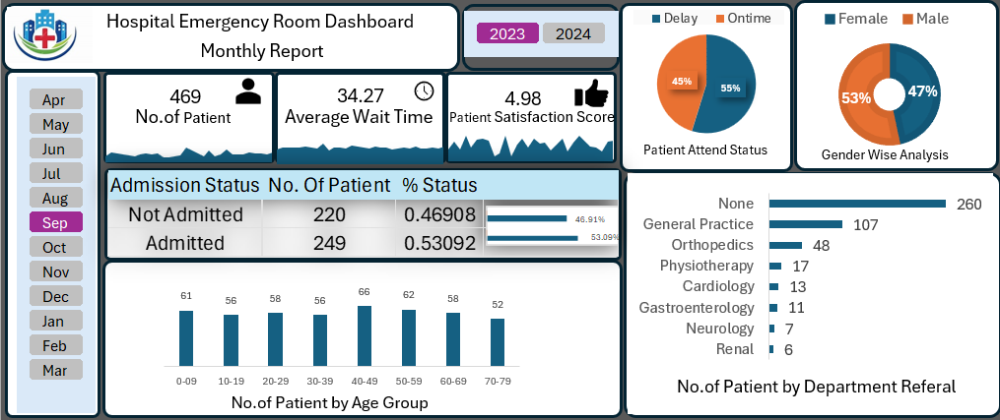

# Hospital Emergency Room Dashboard (Excel)

## 📌 Project Overview

This project presents an interactive Hospital Emergency Room Dashboard created in Microsoft Excel. The dashboard helps analyze patient visits, admissions, waiting times, referrals, satisfaction scores, gender distribution, and age groups through interactive charts and slicers.

---

## 📊 Dashboard Features

- Monthly Report Analysis
- Total Number of Patients
- Average Wait Time
- Patient Satisfaction Score
- Admission Status
- Department Referral Analysis
- Gender-wise Patient Distribution
- Patient Attendance Status
- Age Group Analysis
- Year and Month Filters

---

## 📈 Key Performance Indicators (KPIs)

- Total Patients: **469**
- Average Wait Time: **34.27 Minutes**
- Patient Satisfaction Score: **4.98 / 5**
- Admission Status:
  - Admitted: **249**
  - Not Admitted: **220**

---

## 🛠 Tools Used

- Microsoft Excel
- Pivot Tables
- Pivot Charts
- Slicers
- Conditional Formatting
- Excel Formulas
- Dashboard Design

---

## Dashboard Preview

## Dashboard Preview

---

## 💡 Key Insights

- More than half of the patients were admitted.
- Patient satisfaction remained close to 5/5.
- Most referrals were categorized as "None" and General Practice.
- The 40–49 age group recorded the highest number of patients.
- Male patients slightly outnumbered female patients.

---

## 📚 Skills Demonstrated

- Excel Dashboard Development
- Data Cleaning
- Data Visualization
- KPI Reporting
- Interactive Dashboard Design
- Business Analytics
- Data Analysis

---

## 🚀 Author

**Aayush Khanvilkar**

Aspiring Data Analyst

